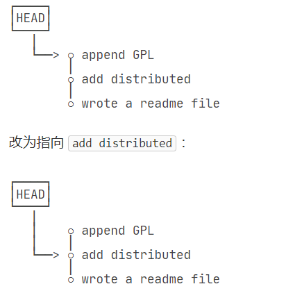

# 1.常用命令行（空格数量得严格按照要求来）

```
$ cd + 文件路径
/*cd (change directory):转换到某文件位置；*/
```

```
$ makdir + 文件名
/*mkdir(make directory):创建目录*/
```

```
$ pwd 
/*pwd(print working directory):打印当前目录位置*/
```

```
$ git init
/*初始化仓库(注意，得在创建的目录下初始化才能将创建的目录转化为仓库)*/
```

```
$ git status
/*查看当前仓库状态*/
```

```
$ git add + 文件名
/*将文件添加到暂存区(注意，该文件必须在当前目录下面)*/
```

```
$ git commit -m + 描述文字
/*将文件提交到仓库*/
```

```
$ git diff + 文件名
/*diff(diffence):查看具体更改内容*/
```

```
$ git log (--pretty=oneline)
/*产看日志(加上括号里面的为每个日志显示为一行)*/
```

```
$ git reset --hard commit_id
/*作用：回滚到某个历史工作区
注解：
1.commit_id指的是某个commit的ID；
2.此时再用git log查看日志，就没有在回退时间之后的了。若要查看之后的，可以用git reflog*/
```

```
$ git reflog
/*reflog(reference log)查看所有更新分支的命令和引用*/
```

```
$ cat + file
$ cat  file1 file2 > target_file
/*cat(print and concatenate)
1.打印文件
2.合并文件*/
```

```
$ git checkout -- <file>
/*将未存入暂存区的修改撤销，即让这个文件回到最近一次git commit或git add时的状态*/
$ git reset HEAD <file>
/*将存入暂存区的修改回退到工作区*/
```

```
$ rm <file>
/*删除工作区的文件，未添加到工作区，可恢复*/

$ git rm <file>
$ git commit -m <"">
/*从版本库里面删除文件，无法恢复*/
```

```
$ git checkout -- <file>
/*checkout 实质上是把版本库的文件复制到工作区
只要文件添加到版本库了且版本库里面的文件未被删除，都可以恢复*/
```

```
$ git remote add origin git@github.com:<用户名>/<仓库名>（ssh方式拉取）
$ git remote add origin <URL>(最后有一个.git)（http方式拉取）
/*与远程库建立联系*/
$ git push (-u) origin master
/*
将本地版本库推送到Github上
注释:
1.origin:origin的意思是指“远程仓库”，就是远程仓库链接的别名。git默认创建的指向这个远程代码库的标签，origin指向的就是本地的代码库托管在Github上的版本
2.master:本地仓库名
3.-u只在第一次提交时才用，目的是简化以后提交的流程
*/
$ git remote -v
/*显示远程库信息*/
$ git remote rm origin
/*此处的“删除”其实是解除了本地和远程的绑定关系，并不是物理上删除了远程库。远程库本身并没有任何改动。要真正删除远程库，需要登录到GitHub，在后台页面找到删除按钮再删除。*/
```

# 2. Git工作原理

1.各历史工作区都有一个指针HEAD指向它



2.工作区和暂存区

在创建版本库的时候，Git会自动帮我们创建一个master分支，master分支存储着我们的历史文件。


我们先用add把修改添加到暂存区(stage)，再用commit把修改一次性添加到master分支，这时如果没有其他操作，我们的工作区就“干净”了。

注意：Git和其他管理系统不一样的是，它是存储的修改，而不是文件。所以我们每修改一次，就得把修改add入stage。
